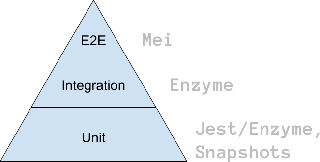

import { Head, Image } from 'mdx-deck';
import { CodeSurfer } from 'mdx-deck-code-surfer';
export { default as theme } from './theme';

<Head>
  <title>Front-End Testing by Alessia Bellisario</title>
</Head>

## Front-End Testing

### By Alessia Bellisario

---

# <🔺>

#### ^ proverbial pyramid

---

## Testing Pyramid


```notes
Why the pyramid metaphor?
- Mike Cohn, one of the inventors of Scrum, coined it
- He originally drew it in 2003-4 and described it at a scrum gathering in 2004
```

---

## Breather's Front-End

## Testing Pyramid



---

Overview

1. Objectives
2. State of front-end testing at Breather
3. React Testing Library vs. Enzyme
4. Patterns

---

---

<CodeSurfer
  title="Lines"
  code={require('!raw-loader!./snippets/1.mdx')}
  steps={[
    { notes: 'Use ⬆️ and ⬇️ keys' },
    { lines: [6], notes: 'Highlight a single line ⬇️' },
    { lines: [5, 7, 8], notes: '... or multiple lines ➡️' },
  ]}
/>

---

<CodeSurfer
  title="Scale and Scroll"
  code={require('!raw-loader!./snippets/5.jsx')}
  steps={[
    { notes: 'Long snippets are scaled ⬇️' },
    { range: [1, 3], notes: '⬇️' },
    { range: [5, 13], notes: '⬇️' },
    { range: [15, 32], notes: '⬇️' },
    { lines: [30, 35], notes: '⬇️' },
    { range: [15, 32], lines: [40], notes: '➡️' },
  ]}
/>

---

Talk outline:

- testing pyramid
- integration tests
- goal of testing?
  - example of web-utils code formatting fn: write tests for legacy code, refactor the internals but don't change the fn signature
    <!-- - state of code coverage -->
- react-testing-library
  - benefits?
    - https://twitter.com/housecor/status/1047150875502960641
    - comparison blog post https://medium.com/homeaway-tech-blog/integration-testing-in-react-21f92a55a894
  - contrast with enzyme
    - show examples of enzyme tests
  - .instance() tests = brittle, hooks are coming...
  - events: https://github.com/kentcdodds/dom-testing-library/blob/master/src/events.js
  - snapshot testing?
- social proof (Guillermo Rauch, Kent C. Dodds, Jamie Builds)

  - https://twitter.com/jamiebuilds/status/1070062304518004736
  - https://twitter.com/housecor/status/1074319158362415106
  - Gatsby: https://www.gatsbyjs.org/docs/testing-react-components/
  - react-redux uses RTL: https://github.com/reduxjs/react-redux/blob/v6.0.0/test/components/connect.spec.js
  - testing a component that uses Context https://egghead.io/lessons/react-test-a-component-that-uses-a-react-context-consumer

- best practices:
  - make tests resilient! Shouldn't break when strings change E.g. https://twitter.com/kyleshevlin/status/921169512140914688?ref_src=twsrc%5Etfw%7Ctwcamp%5Etweetembed%7Ctwterm%5E921169512140914688&ref_url=https%3A%2F%2Fblog.kentcdodds.com%2Fmedia%2F1cc146ae6727f5cfd6012f47f2f80aa1%3FpostId%3Dd37a6ee37269
    - data-testid and babel plugin to remove in prod
- JSDOM? E2E tests?
- EXAMPLES:
  - Kent C Dodds react-redux example from RTL repo https://github.com/kentcdodds/react-testing-library/blob/master/examples/__tests__/react-redux.js
  - Kent C Dodds react-router example https://github.com/kentcdodds/react-testing-library/blob/master/examples/__tests__/react-router.js
  - react-testing-examples https://react-testing-examples.com/jest-enzyme/
