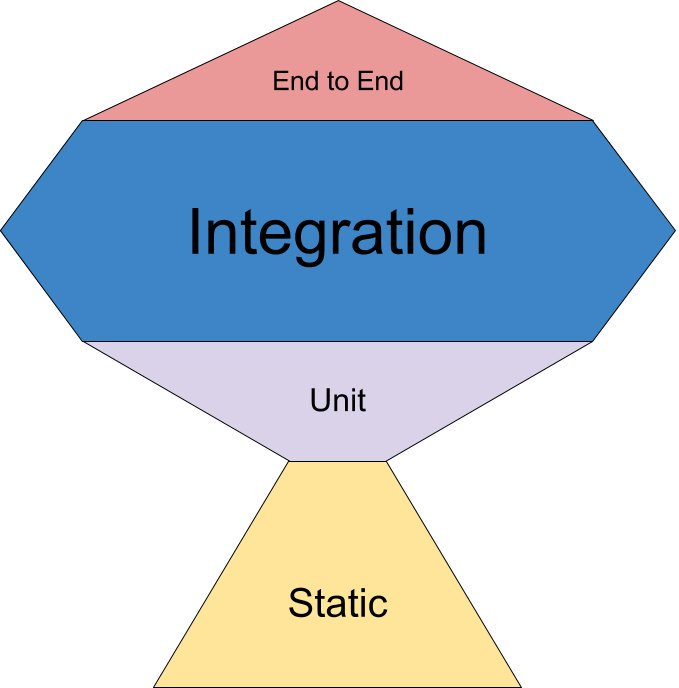

import { Head, Image, Appear } from 'mdx-deck';
import { CodeSurfer } from 'mdx-deck-code-surfer';
export { default as theme } from './theme';

<Head>
  <title>🏄🏻‍♀️ front-end testing🏄🏻‍♀️ by Alessia Bellisario</title>
</Head>

# 🏄🏻‍♀️ front-end testing🏄🏻‍♀️

### by Alessia Bellisario

---

# 🔺

#### ^ proverbial pyramid

---

## testing pyramid


```notes
Why the pyramid metaphor?
- Mike Cohn, one of the inventors of Scrum, coined it
- He originally drew it in 2003-4 and described it at a scrum gathering in 2004
```

---

## FE testing pyramid @ Breather


---

## testing trophy



```notes
Coined by Kent C. Dodds
see: https://twitter.com/kentcdodds/status/960723172591992832?lang=en
```

---

# overview

1.  review testing terms
2.  front-end testing at Breather
3.  React Testing Library vs. Enzyme
4.  patterns

---

## terminology

- **test runner**: runs tests, e.g. Wallaby, Karma, Jest in jest-runner
- **testing framework**: organizes tests (in Jest, think: `describe` = suite, `it` = spec), e.g. Jest, AVA, Jasmine, Mocha, etc.
- **mocking framework**: Jest, Sinon.js
- **assertion library**: verify code's behaviour, e.g. Jest, AVA, Chai, ShouldJS

---

...what about enzyme?

---

> "Enzyme is a JavaScript _Testing utility_ for React that makes it easier to assert, manipulate, and traverse your React Components' output."
>
> https://airbnb.io/enzyme/

---

## 🎉 testing utilities 🎉

---

enzyme

the API revolves around manipulating ReactComponents via the ReactWrapper returned from find() or the React component itself using instance() rather than DOM nodes (what the end user would be interacting with)

---

<CodeSurfer
  title="enzyme"
  code={require('!raw-loader!./snippets/enzyme.jsx')}
  steps={[
    { notes: 'use ⬆️ and ⬇️ keys' },
    { range: [7, 10], notes: 'shallow render' },
    { range: [11, 16], notes: 'test props' },
  ]}
/>

```notes
see: setProps utility fn provided by Enzyme

@TODO: define shallow vs mount?
```

---

"testing implementation details"

---

<CodeSurfer
  title="enzyme: calling react component methods"
  code={require('!raw-loader!./snippets/implementationDetails.jsx')}
/>

---

## testing implementation details

1.  will this test break when there’s a mistake that would break the component in production?
2.  will this test continue to work when there’s a fully backward compatible refactor of the component?

---

<CodeSurfer
  title="enzyme: calling react component methods"
  code={require('!raw-loader!./snippets/implementationDetailsWComments.jsx')}
  steps={[
    { notes: 'use ⬆️ and ⬇️ keys' },
    { lines: [1, 2, 3, 4, 5, 16], notes: '❌' },
    { lines: [7, 8, 9, 10, 11, 16], notes: '❌' },
  ]}
/>

---

<CodeSurfer
  title="rtl prototype"
  code={require('!raw-loader!./snippets/gist.jsx')}
  steps={[
    { notes: 'use ⬆️ and ⬇️ keys' },
    {
      range: [1, 37],
      notes:
        'https://gist.github.com/kentcdodds/7a9bed9639cb8900d0bce9f0c513c8c9',
    },
    {
      range: [38, 62],
      notes:
        'https://gist.github.com/kentcdodds/7a9bed9639cb8900d0bce9f0c513c8c9',
    },
  ]}
/>

---

| ENZYME                                                 | RTL                                  |
| ------------------------------------------------------ | ------------------------------------ |
| ✅ querying elements by class name                     | ❌                                   |
| ✅ shallow rendering                                   | ❌ implementation details            |
| ✅ getting a component `instance`                      | ❌ implementation details            |
| ✅ getting and setting a component's props (`props()`) | ❌ implementation details            |
| ✅ getting and setting a component's state (`state()`) | ❌ implementation details            |
| ❌                                                     | ✅ testing real DOM elements         |
| ❌                                                     | ✅ utils for async DOM manipulations |

---

things react testing library cannot do

- shallow rendering
- querying elements by class name
- getting a component instance
- ~~getting and setting a component's props (`props()`)~~
- getting and setting a component's state (`state()`)

---

- Even with `mount` in Enzyme, the API revolves around manipulating ReactComponents via the ReactWrapper returned from find() or the React component itself using instance() rather than DOM nodes (what the end user would be interacting with).
  souce: https://medium.com/homeaway-tech-blog/integration-testing-in-react-21f92a55a894
- paired down example of RTL in Kent C. Dodds' gist https://gist.github.com/kentcdodds/7a9bed9639cb8900d0bce9f0c513c8c9

Talk outline:

- unit testing args passed to API calls

Can you get DOM nodes in Enzyme? Kinda, but not really > https://github.com/airbnb/enzyme/blob/master/docs/api/ReactWrapper/getDOMNode.md

- can only be called on a wrapper of a single node.
- will raise if called on a wrapper of a stateless functional component.

- goal of testing?
  - example of web-utils code formatting fn: write tests for legacy code, refactor the internals but don't change the fn signature
    <!-- - state of code coverage -->
- react-testing-library

  - benefits?
    - https://twitter.com/housecor/status/1047150875502960641
    - comparison blog post https://medium.com/homeaway-tech-blog/integration-testing-in-react-21f92a55a894
  - contrast with enzyme
    - show examples of enzyme tests
  - .instance() tests = brittle, hooks are coming... https://blog.kentcdodds.com/react-hooks-whats-going-to-happen-to-my-tests-df4c2b4d67b7
  - events: https://github.com/kentcdodds/dom-testing-library/blob/master/src/events.js
  - snapshot testing?

- social proof (Guillermo Rauch, Kent C. Dodds, Jamie Builds)

  - https://twitter.com/jamiebuilds/status/1070062304518004736
  - https://twitter.com/housecor/status/1074319158362415106
  - Gatsby: https://www.gatsbyjs.org/docs/testing-react-components/
  - react-redux uses RTL: https://github.com/reduxjs/react-redux/blob/v6.0.0/test/components/connect.spec.js
  - testing a component that uses Context https://egghead.io/lessons/react-test-a-component-that-uses-a-react-context-consumer

- best practices:

  - make tests resilient! Shouldn't break when strings change E.g. https://twitter.com/kyleshevlin/status/921169512140914688?ref_src=twsrc%5Etfw%7Ctwcamp%5Etweetembed%7Ctwterm%5E921169512140914688&ref_url=https%3A%2F%2Fblog.kentcdodds.com%2Fmedia%2F1cc146ae6727f5cfd6012f47f2f80aa1%3FpostId%3Dd37a6ee37269
    - data-testid and babel plugin to remove in prod

- JSDOM? E2E tests?

- EXAMPLES:
  - Kent C Dodds react-redux example from RTL repo https://github.com/kentcdodds/react-testing-library/blob/master/examples/__tests__/react-redux.js
  - Kent C Dodds react-router example https://github.com/kentcdodds/react-testing-library/blob/master/examples/__tests__/react-router.js
  - react-testing-examples https://react-testing-examples.com/jest-enzyme/
